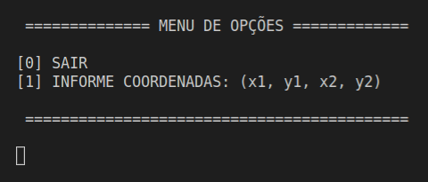
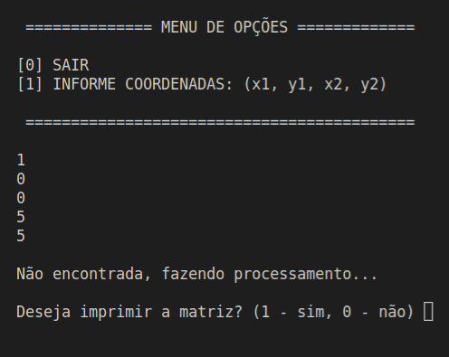
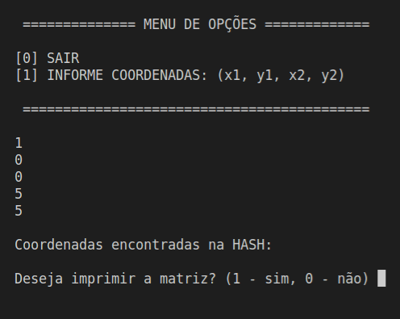
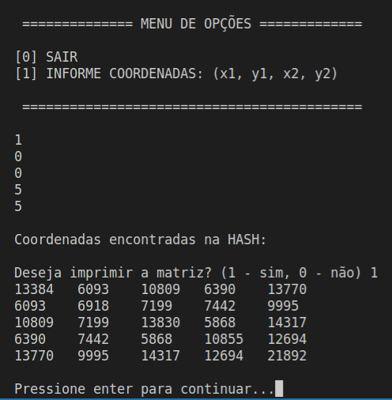

<!-- map<string, vector<vector<int>>> mapa2;
	map<string, vector<vector<int>>> ::iterator itr;
Usado para o armazenamento e a recuperação de dados de uma coleção em que cada elemento é um par que contém um valor de dados e uma chave de classificação. O valor da chave é exclusivo e usado para classificar os dados automaticamente.

O valor de um elemento em um mapa pode ser alterado diretamente. O valor de chave é uma constante e não pode ser alterado. Em vez disso, os valores de chave associados aos elementos antigos devem ser excluídos e os novos valores de chave devem ser inseridos para novos elementos. -->

Documentação: Readme.md descrevendo o problema e todas as informações pertinentes a resolutividade do mesmo. Aplique exemplos para explicar o funcionamento de sua solução e estabeleça uma tabela para detalhar o resultado esperado e como deve ser compilada.

# Treinamento de Estrutura HASH
<h2 align="center"> Marinêz Werneck Magalhães </h2>

 

- Descrevendo o problema:

Implementou-se multiplicação de matrizes, com valores muito grandes (MAX x MAX), para teste usou-se (1000 x 1000) números inteiros, obtidos através do site: https://mxncalc.com/pt/generator. Tokenizou-se a matriz (função tokenizar) para retirar as virgulas, fez-se o processamento a partir de coordenadas fornecidas pelo usuário, dupla de i e j correspondendo a posição inicial e final a ser lida, na l1(linha inicial), c1(coluna inicial), l2(linha final), c2(coluna final).

Fez-se a leitura a partir das coordenadas (função quadranteMatriz), produziu-se a transposta da matriz (função transposta). Feito isso, executou-se a multiplicação (função multiplicaMatriz) armazenamento em uma HASH o resultado da multiplicação como valor para a dupla de i's e j's (função transformaMatriz), os quais são utilizados como chaves da HASH. Após cada novo cálculo, o sistema consulta a HASH para identificar se a multiplicação já foi realizada (função buscarChave), se sim, retorna resposta (função imprimeTransfMatriz). Caso contrário, multiplica e armazena o conteúdo em cache.

### Menu Inicial

  </img>

### Menu apresentando não encontro de colisões

  </img>

### Menu apresentando encontro de colisões e perguntando se quer imprimir a matriz

  </img>

### Menu com impressão da matriz com os valores após os processamentos.

  </img>

## Compilação:

### Compilação padrão

| Comando | Função |
|---------| --------|
| `make clean` | Apaga a última compilação realizada contida na pasta build |
| `make` | Executa a compilação do programa utilizando o gcc, e o resultado vai para a pasta build |
| `make run` | Executa o programa da pasta build após a realização da compilação |

### Compilação alternativa

| Comando | Função |
|---------| --------|
| `make r` | Limpa tudo, compila e executa |

